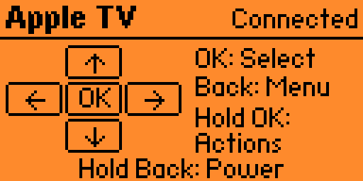
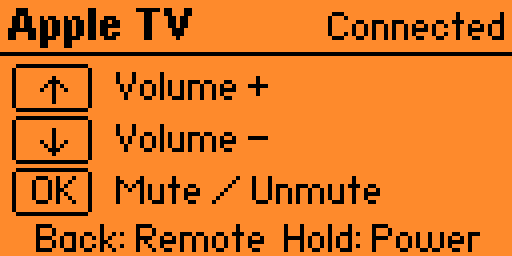

# Apple TV Remote for Flipper Zero

A custom Apple TV remote for Flipper Zero, developed with OpenAI Codex. Connects over Bluetooth, so no infrared or line of sight is needed.

**Runs on the standard, official Flipper Zero firmware — no custom firmware needed.** Built and tested with firmware **1.4.3 / API 87.1**.

Independent project, not an official Apple or Flipper Devices app.

**Version 1.6 fixes exiting while disconnected.** Back exits from the disconnected main screen; hold Back in Actions to exit at any connection state. Version 1.5 added Volume / Mute mode, confirmed working by the owner on 27 September 2026.

[Download the app](https://github.com/KronenbergBN/flipper-apple-tv-remote/releases/latest) · [Source code](https://github.com/KronenbergBN/flipper-apple-tv-remote)



*Screenshot from the app running on a real Flipper Zero.*

## Install and pair

Copy the release file `apple_tv_remote.fap` to `SD Card/apps/Bluetooth/` with qFlipper. Start Applications > Bluetooth > Apple TV. On Apple TV, open Settings > Remotes and Devices > Bluetooth and choose `Control <your Flipper name>`. Confirm matching pairing codes when prompted.

The app shares the official Bluetooth Remote app's local pairing store. Existing pairing may be reused; no pairing keys are distributed.

## Controls

| Button | Function |
| --- | --- |
| Directions | Navigate; hold to repeat |
| Short OK | Select / wake |
| Hold OK | Actions menu |
| Short Back | Connected: Back/menu. Disconnected main screen: exit. Actions: cancel |
| Hold Back | Connected remote/volume screen: two-second Power press. Actions or disconnected: exit locally |
| Actions > Exit app | Exit locally, including while disconnected |

Actions: Volume / Mute, Play / Pause, Wake (OK), Power hold, Exit app. Choose with Up/Down and execute with short OK. Power sends a two-second Bluetooth HID Power press. To exit while connected, hold OK to open Actions, then hold Back. Without a connection, press Back on the main screen (or hold Back on any screen).

## Volume mode



Hold OK, then press OK briefly to enter **Volume / Mute**, the first Actions item.

| Button in Volume mode | Function |
| --- | --- |
| Up / Down | Volume up / down; hold to repeat |
| Short OK | Mute / unmute |
| Short Back | Return to navigation without sending a Back command |
| Hold Back | Connected: existing two-second Power command. Disconnected: exit |
| Hold OK | Actions menu |

The app sends Bluetooth HID consumer Volume Increment (0xE9), Volume Decrement
(0xEA), and Mute (0xE2) to Apple TV. It does not pair directly with a HomePod
or change the selected audio output. On 27 September 2026, the owner confirmed
that Volume / Mute mode works with their configured HomePod/AirPlay audio setup.
Compatibility with other audio setups has not been established.
No IR transmitter or television-specific volume codes are used.

Navigation, Power and Exit regression tests pass together with new checks for
volume repeat, exactly one mute per short press, local mode changes, and no
commands while disconnected. Build, SDK imports and lint passed. The installed file was read back byte-for-byte and the connected Volume screen was verified in qFlipper.

## Verified behavior and limits

Tested by the owner on **Apple TV 4K, model A2843 (128 GB), tvOS 26.6**, with **Flipper Zero official firmware 1.4.3**. The owner confirmed power on/off with version 1.2 on 26 September 2026. Bluetooth pairing/reconnection, English UI and installation readback were verified. The fixed left button passes an actual-handler regression test; a separate physical retest of Left is still unreported. TV power behavior depends on the connected setup. Siri, microphone and touch gestures are not implemented. The owner confirmed the v1.5 volume mode on 27 September 2026.

Version 1.4 fixes the Back-hold shortcut: it sends the existing two-second Power command instead of exiting to Favorites. Exit was moved to an explicit Actions entry, accessible even without a Bluetooth connection; version 1.6 also adds direct local exit shortcuts. The regression test reproduced the previous failure and passes with the fix; firmware build, SDK import checks and lint passed. Version 1.4 was installed and verified by byte-for-byte readback; on 27 September 2026, the owner confirmed that holding Back now powers off both the Apple TV and the connected TV while the Flipper app stays open. Compatibility with other firmware versions or Apple TV models is not established.

## Build

```sh
python3 -m venv .venv
.venv/bin/python -m pip install ufbt==0.2.6
.venv/bin/ufbt update --branch=1.4.3
.venv/bin/ufbt
.venv/bin/ufbt lint
python3 tests/test_controls.py
```

Output: `dist/apple_tv_remote.fap`. Tests require Clang and the installed SDK.

## Related projects

[Google TV Remote for Flipper Zero](https://github.com/cyberandy/flipper-google-tv-remote) by [cyberandy](https://github.com/cyberandy) adapts this project's Bluetooth setup and app structure for Chromecast with Google TV and adds Epson projector power control over infrared. See that project's README for supported devices, installation instructions and test results.

## Contributors

- **Hanns Kronenberg**: project direction, device testing and maintenance.
- **OpenAI Codex**: AI-assisted development, debugging and documentation.

## References

- https://github.com/flipperdevices/flipperzero-firmware/tree/1.4.3
- https://github.com/flipperdevices/flipperzero-ufbt

## License

GPL-3.0-only. See [LICENSE](LICENSE). The build uses the official Flipper firmware SDK and its BLE profile library, available from the firmware reference above.
