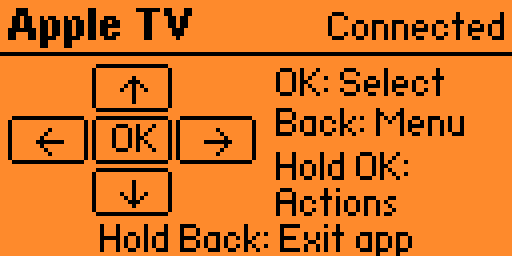

# Apple TV Remote for Flipper Zero

A custom Apple TV remote for Flipper Zero, developed with OpenAI Codex. Connects over Bluetooth, so no infrared or line of sight is needed.

**Runs on the standard, official Flipper Zero firmware — no custom firmware needed.** Built and tested with firmware **1.4.3 / API 87.1**.

Independent project, not an official Apple or Flipper Devices app.

[Download the app](https://github.com/KronenbergBN/flipper-apple-tv-remote/releases/latest) · [Source code](https://github.com/KronenbergBN/flipper-apple-tv-remote)



*Screenshot from the app running on a real Flipper Zero.*

## Install and pair

Copy the release file `apple_tv_remote.fap` to `SD Card/apps/Bluetooth/` with qFlipper. Start Applications > Bluetooth > Apple TV. On Apple TV, open Settings > Remotes and Devices > Bluetooth and choose `Control <your Flipper name>`. Confirm matching pairing codes when prompted.

The app shares the official Bluetooth Remote app's local pairing store. Existing pairing may be reused; no pairing keys are distributed.

## Controls

| Button | Function |
| --- | --- |
| Directions | Navigate; hold to repeat |
| Short OK | Select / wake |
| Hold OK | Actions menu |
| Short Back | Back/menu; cancel in Actions |
| Hold Back | Exit app |

Actions: Play / Pause, Wake (OK), Power hold, Back to remote. Choose with Up/Down and execute with short OK. Power sends a two-second Bluetooth HID Power press.

## Verified behavior and limits

Tested by the owner on **Apple TV 4K, model A2843 (128 GB), tvOS 26.6**, with **Flipper Zero official firmware 1.4.3**. The owner confirmed power on/off with version 1.2 on 26 September 2026. Bluetooth pairing/reconnection, English UI and installation readback were verified. The fixed left button passes an actual-handler regression test; a separate physical retest of Left is still unreported. TV power behavior depends on the connected setup. Siri, microphone, touch gestures and volume are not implemented.

Version 1.3 generalizes the pairing label and removes the Power action's test label; transmitted commands are unchanged. This release build has not been installed on the owner's Flipper. Compatibility with other firmware versions or Apple TV models is not established.

## Build

```sh
python3 -m venv .venv
.venv/bin/python -m pip install ufbt==0.2.6
.venv/bin/ufbt update --branch=1.4.3
.venv/bin/ufbt
.venv/bin/ufbt lint
python3 tests/test_controls.py
```

Output: `dist/apple_tv_remote.fap`. Tests require Clang and the installed SDK.

## References

- https://github.com/flipperdevices/flipperzero-firmware/tree/1.4.3
- https://github.com/flipperdevices/flipperzero-ufbt

## License

GPL-3.0-only. See [LICENSE](LICENSE). The build uses the official Flipper firmware SDK and its BLE profile library, available from the firmware reference above.
